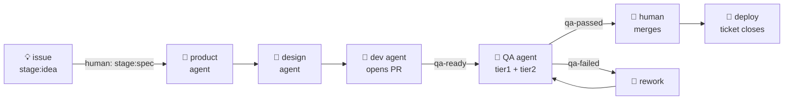

# agentic-development

**An agentic SDLC, end to end:** an idea filed as a GitHub issue flows through
product → design → development → QA → deploy, with each phase executed by a
Claude Code agent inside a deterministic, label-driven GitHub Actions state
machine. The demo apps underneath are deliberately tiny — the pipeline is the
product.

## North star

> File an idea. A spec appears. A design appears. A PR appears with tests. A QA
> agent boots the stack, verifies the acceptance criteria in a real browser, and
> posts an evidence-backed verdict that gates the merge. A human merges. It
> deploys. The ticket closes itself.

The design follows the 2025–26 industry consensus (Anthropic's *Building
Effective Agents*, GitHub's agentic workflows): **workflows over agents** —
deterministic orchestration owns every state transition; the model only fills in
content inside a phase, and always through schema-validated structured output.



## Start here

If you have pulled this repo to learn from it, read in this order — the first
two items are printable and need no tooling:

1. **[`docs/handbook/01-lab-review.pdf`](docs/handbook/01-lab-review.pdf)** —
   what was built and what it found. Three rounds of measured results, the
   six-seat operating model, and the findings ledger. 11 pages.
2. **[`docs/handbook/02-system-map.pdf`](docs/handbook/02-system-map.pdf)** —
   how the machine works: every trigger, every guard, and *the incident behind
   each one*. This is the transferable part; almost nothing here was designed
   up front. 8 pages.
3. **[`docs/sdlc.md`](docs/sdlc.md)** — the binding spec the workflows
   implement. If the code and this file disagree, the file wins.
4. **[`docs/lab-charter.md`](docs/lab-charter.md)** — the experiment method:
   how rounds are run, what is measured, and what the numbers may not claim.
5. **[`docs/learning-log.md`](docs/learning-log.md)** — the raw chronological
   record. Every guard in the system traces back to an entry here.

If any of the vocabulary is unfamiliar — headless mode, skills, plugins, MCP,
permission modes, structured output — **[`docs/handbook/04-glossary.md`](docs/handbook/04-glossary.md)**
defines it, says where it appears in this repo, and links to Anthropic's own
documentation for it.

Then, depending on what you came for: **`docs/playbooks/`** for how each of the
six roles changes; **`docs/case/`** for the round briefs and the frozen cost
baselines; **`.github/workflows/`** + **`scripts/`** for the mechanism itself.

The two ideas most worth stealing, if you read nothing else:

- **Deterministic orchestration, AI-filled content.** GitHub Actions and shell
  own every state transition. The model only produces content inside a phase,
  always as schema-validated JSON. No model output is ever parsed for control
  flow.
- **Prose is not a boundary.** Any rule that lives only in an agent's
  instructions will eventually be walked through. If a rule matters, it needs a
  deterministic step that fails the build — see the three-layer privileged-path
  boundary in the system map, where only the third layer holds.

## What's here

| Path | What |
|---|---|
| `docs/sdlc.md` | **The state-machine spec** — labels, phase contracts, gates, trust boundaries |
| `docs/apps.md` / `docs/setup.md` | App contracts / one-time setup |
| `.github/workflows/` | The pipeline: `phase-product`, `phase-design`, `phase-dev`, `phase-qa`, `ci`, `deploy`, `nightly-fuzz`, `assistant` |
| `ci/claude/` | Agent assets: per-phase skill plugins, JSON output schemas, CI settings, Playwright MCP config |
| `scripts/` | Deterministic glue: `run_agent.sh` (the one Claude invocation), `qa_gate.py`, `transition.sh`, `loop_guard.sh`, `resolve_pr.sh`, `state_lint.py` |
| `apps/api` + `apps/web` | Taskboard demo: FastAPI JSON API + server-rendered UI |
| `gateway/` | Cloudflare Worker gateway (Wrangler v4): API-key auth, rate limiting, routing, request IDs |
| `qa/` | Deterministic suites: Playwright E2E + Schemathesis contract tests |
| `watcher/` | Phase 2: an Agent-SDK "ticket watcher" service — the same state machine, local runtime |
| `docs/handbook/` | Printable overviews (PDF + offline HTML) and `scripts/render_handbook.py` to rebuild them |
| `docs/case/` | Round briefs, the frozen metrics baselines, and the cited bibliography |
| `docs/playbooks/` | One per seat: product manager, dev manager, developer, infra, QA |

## The QA agent (the centerpiece)

`phase-qa.yml` fires when a PR gets `qa-ready`:

1. **Tier 1 (deterministic, the hard gate):** boots the full stack (compose +
   `wrangler dev`), seeds data, runs unit/integration, Schemathesis contract,
   and Playwright E2E suites. Exit codes gate directly.
2. **Tier 2 (agentic):** one bounded `claude -p` run — the `/qa:qa-run` skill —
   verifies each acceptance criterion in a real browser via Playwright MCP,
   runs an exploratory charter (console + network inspection after every flow),
   and triages tier-1 failures as bug/infra/flake.
3. **The gate is code, not vibes:** `scripts/qa_gate.py` combines tier-1
   outcomes with the agent's schema-validated verdict, posts the
   `qa/agent-verdict` commit status on the head SHA (required by branch
   protection), posts an evidence-backed comment, and the App token flips the
   label — `qa-passed`, `qa-failed` (dev agent reworks, max 3 cycles), or
   `needs-human`.

## Try it

```bash
make install && make stack-up && make gateway-dev &   # local stack
make seed && make test && make e2e                    # local suites
```

Pipeline: complete `docs/setup.md` (≈10 minutes), then file a feature issue and
add the `stage:spec` label. That label is the only human act until the merge
button.

## Design rules that keep it predictable

- The model never chooses a state transition; labels move only via
  `scripts/transition.sh` under the `sdlc-orchestrator` App token.
- Every agent returns structured output validated against a committed JSON
  schema; free text is never parsed for control flow.
- Every agent claim needs evidence (repro steps, artifacts) — a `fail` without
  reproduction is downgraded to `blocked` by the gate.
- Bounded everything: `--max-turns`, job timeouts, per-ticket concurrency
  groups, loop guards on the label timeline, 3-strike QA↔rework cap.
