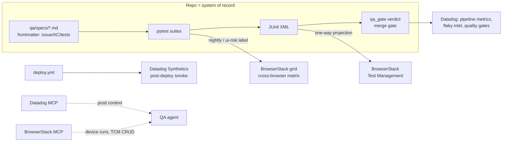

# The Real System: BrowserStack, Test Case Management, Datadog

How this pipeline plugs into an enterprise QA ecosystem. Researched July 2026;
nothing here is integrated yet — this is the map and the adoption order.

## The test-case-management question (the important one)

**Decision: the repo is the system of record; any TCM is a one-directional
projection.** The 2026 consensus (Playwright's own planner/generator/healer
agents, spec-driven development, code-first TCM workflows) is that the QA-style
"test case" — steps + expected results — lives in git as a markdown spec,
authored and maintained by agents, reviewed in PRs:

```
qa/specs/<feature>/<scenario>.md     # Given/When/Then steps + expected results
---
issue: 7          # ticket
ac: [AC-1, AC-3]  # acceptance criteria covered
tests: [qa/tests/e2e/test_reminders.py::test_degraded_banner]
---
```

- The frontmatter is the traceability chain: **ticket → AC → spec → test →
  JUnit result → verdict comment**, all greppable in git.
- CI lints the 1:1 mapping both ways (a spec without a test or a test without a
  spec fails the build) — otherwise the alignment rots within weeks.
- The QA agent's exploratory session records (charter, log, evidence, findings)
  are first-class artifacts on the PR; anything audit-relevant gets promoted
  beyond the 90-day Actions artifact retention.
- **TCM = projection**: one CI step pushes the same JUnit XML the verdict is
  built from into the TCM. Never author cases in the TCM; dual-authoring drift
  is the classic failure mode.

**Projection target: BrowserStack Test Management** (same vendor as the device
cloud; free tier is real — unlimited cases, 30-day run history):
`POST test-management.browserstack.com/api/v1/import/results/xml/junit` with
`test_run_name = PR-<n>-<sha>` auto-creates/updates cases from our JUnit.
Pitfall to design around: auto-creation keys on test name/classname — pin
stable case IDs in pytest properties before renaming/parametrizing.

## BrowserStack execution (cross-browser grid)

- **Per-PR stays local** (compose + headless chromium): free, fast, the merge
  gate. The grid costs ~$129–249/parallel/month and bills by fixed parallels —
  per-PR cloud matrices queue or force over-provisioning.
- **Grid runs are a separate workflow**: merge-to-main/nightly, or per-PR only
  when a `ui-risk` label is set (the dev/QA agent can set it). Integration:
  `browserstack-sdk pytest` + `browserstack.yml` (matrix as data — the agent can
  generate it per-run), `browserstackLocal: true` tunnels the grid to the CI
  job's localhost compose stack. Pin `client.playwrightVersion` (grid supports
  only the latest 3 Playwright majors).
- **Agent surface**: official MCP server (~44 tools incl. Test Management CRUD,
  Automate, Percy, a11y scans). Run it **locally in CI** with access-key env
  (the remote OAuth variant can't start Local tunnels and headless agents can't
  OAuth). It's pre-1.0 — convenience layer only; REST + JUnit import are the
  stable contracts and the only things allowed in the merge-gating path.
- Their self-healing agent: evaluate **read-only** — silent selector healing on
  agent-authored tests can mask real regressions; surface heal suggestions as
  PR comments the dev agent applies instead.

## Datadog (observability + test intelligence)

Adoption order, cost-lean first:

1. **Now (≈free): pipeline telemetry.** Post per-phase metrics/events from
   workflow steps (tags: phase, verdict, model, pr_number, cost, turns) via the
   v2 series/events APIs — automates the learning log. Caveat: per-committer
   billing counts git author emails; our bot commits all use one identity
   (`sdlc-orchestrator[bot]`), keep it that way.
2. **Cheap next: Synthetics as post-deploy smoke.** Managed as code in-repo
   (JSON/Terraform), triggered by `deploy.yml` via `datadog-ci synthetics
   run-tests`. ~$5/10k API runs; browser synthetics are ~20x pricier — API/
   multistep per deploy, browser checks sparingly.
3. **At team scale: Test Optimization** ($20/committer/mo) with the **native
   ddtrace pytest plugin in agentless mode** (`pytest --ddtrace`,
   `DD_CIVISIBILITY_AGENTLESS_ENABLED=true`) — JUnit upload silently drops the
   features that matter (Early Flake Detection, Auto Test Retries, Test Impact
   Analysis). **Conflict to resolve at adoption: our E2E retries via
   pytest-rerunfailures must be removed — Datadog's Auto Test Retries owns
   retries, the two mechanisms conflict.**
4. **Agent superpowers: the Datadog MCP server** (GA 2026-03, remote,
   RBAC-scoped, read-heavy toolsets: logs/metrics/spans/monitors/incidents).
   The QA agent pulls failing-service logs and traces before writing its
   verdict; the deploy phase checks error rates post-ship. Budget the fair-use
   limits (50 req/10s, 50k calls/month) in agent loop design.
5. **Later: LLM Observability** traces the agents themselves (per-phase token/
   cost attribution across Anthropic models) — replaces our hand-computed cost
   reporting.

## Summary picture



Nothing above changes the core invariant: the schema-validated verdict in the
repo remains the merge gate; external systems add reach (devices), visibility
(stakeholders), and context (production signals) around it.
