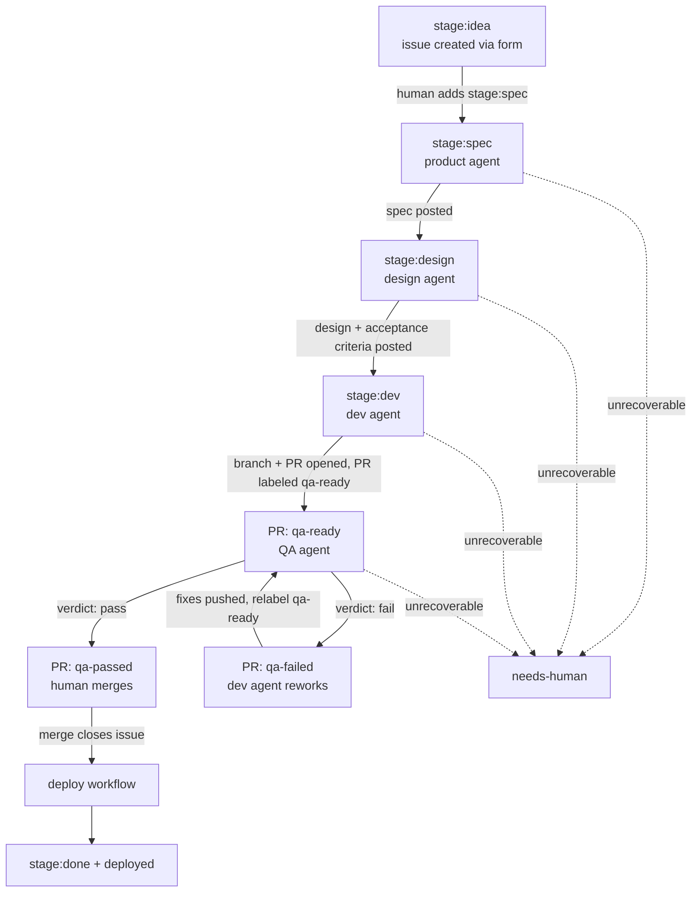

# The Agentic SDLC — State Machine Specification

This document is the contract for the whole pipeline. Every workflow, script, and
agent prompt in this repo implements what is written here. If code and this spec
disagree, the spec wins — fix the code or change the spec in the same PR.

## Principles

1. **Deterministic orchestration, AI-filled content.** GitHub Actions YAML plus
   shell/Python scripts own *when* things happen and *what state changes*. Claude
   owns only the *content* of a phase (a spec, a design, code, a test verdict).
   The model never chooses a state transition.
2. **Structured output or it didn't happen.** Every agent phase must return JSON
   validated against a schema in `ci/claude/schemas/`. Free text is never parsed
   for control flow.
3. **Evidence over assertion.** An agent claim (especially a QA failure) must
   carry reproduction steps and artifact paths. Verdicts without evidence are
   treated as `blocked`, not `fail`.
4. **Humans gate irreversible steps.** Pipeline entry (starting spend) and merge
   (shipping code) are human actions. Everything between is automated.
5. **Transferable.** Nothing here depends on this demo's apps. Swapping the apps,
   the ticket system, or the auth mode is a config change, not a redesign.

## Actors and identities

| Actor | Identity | Used for |
|---|---|---|
| Human | your GitHub account | Files ideas, applies the entry label, merges PRs |
| Pipeline orchestrator | `sdlc-orchestrator` GitHub App (you create it once, see `docs/setup.md`) | **All label transitions and branch pushes that must trigger the next phase.** `GITHUB_TOKEN` events are suppressed by GitHub and never chain. |
| Workflow steps | default `GITHUB_TOKEN` | Everything that must NOT chain: commit statuses, PR comments, artifact uploads |
| Agents | Claude Code headless (`claude -p`), authenticated with `CLAUDE_CODE_OAUTH_TOKEN` | Content generation inside a phase |

Loop safety is our responsibility (GitHub does not suppress App-token recursion):

- Every phase workflow is gated by `if: github.event.label.name == '<its label>'`.
- Every transition removes the inbound label in the same step that adds the
  outbound one. Re-adding a label is the retry mechanism.
- `scripts/loop_guard.sh` counts prior phase-label events on the ticket timeline
  and hard-aborts past `MAX_PHASE_EVENTS` (default 20).
- `scripts/state_lint.py` asserts the label graph below stays acyclic; it runs in CI.

## The state machine

Issue labels carry the pre-code phases. Once code exists, phase labels live on
the **PR** (the `pull_request: labeled` payload carries the head SHA and the run
shows in the PR checks UI); the issue keeps a human-facing mirror label.



### Labels

| Label | On | Meaning | Written by |
|---|---|---|---|
| `stage:idea` | issue | Filed via issue form, not yet approved for the pipeline | issue form |
| `stage:spec` | issue | Product agent is on it | **human** (this is the entry gate) |
| `stage:design` | issue | Design agent is on it | App token |
| `stage:dev` | issue | Dev agent is on it | App token |
| `stage:qa` | issue | Mirror: linked PR is in QA | App token |
| `stage:done` | issue | Merged and deployed | App token |
| `qa-ready` | PR | QA agent should run | App token (dev phase) or human |
| `qa-passed` / `qa-failed` | PR | QA verdict | App token (QA phase) |
| `needs-human` | issue/PR | Pipeline parked; a human must look | App token |
| `deployed` | issue | Deploy workflow finished | App token |

### Phase contracts

Every phase follows the same shape:

```
trigger (labeled event, name-guarded)
  → loop guard
  → deterministic setup (checkout, deps, context files)
  → claude -p invocation (bounded: --max-turns, timeout-minutes, schema-validated output)
  → deterministic post-steps (post comments/statuses with GITHUB_TOKEN)
  → transition (App token: remove inbound label, add outbound label) — in always()
     so the failure path (→ needs-human) also fires
```

| Phase | Workflow | Trigger | Agent skill | Output schema | Success transition |
|---|---|---|---|---|---|
| Product | `phase-product.yml` | issue labeled `stage:spec` | `/product:spec` | `spec-output.json` | → `stage:design` |
| Design | `phase-design.yml` | issue labeled `stage:design` | `/design:design` | `design-output.json` | → `stage:dev` |
| Dev | `phase-dev.yml` | issue labeled `stage:dev` | `/dev:implement` | `dev-report.json` | PR opened with `Fixes #N`, PR labeled `qa-ready`, issue → `stage:qa` |
| Dev rework | `phase-dev.yml` | PR labeled `qa-failed` | `/dev:rework` | `dev-report.json` | push fixes, PR relabeled `qa-ready` |
| QA | `phase-qa.yml` | PR labeled `qa-ready` | `/qa:qa-run` | `qa-verdict.json` | status `qa/agent-verdict` on head SHA; PR → `qa-passed` or `qa-failed` |
| Deploy | `deploy.yml` | push to `main` | none (deterministic) | — | gateway deployed (or simulated), issue → `stage:done` + `deployed` |

Phase outputs are durable: the product spec and the design (including numbered
acceptance criteria `AC-1..AC-n`) are posted as issue comments and appended to
the issue body between HTML marker comments, so later phases read them
deterministically with `gh issue view --json body`.

The dev and rework phases boot `db` + `redis` (`docker compose up -d --wait db
redis`) before the agent runs, with `DATABASE_URL`/`REDIS_URL`/`APP_ENV=test` in
the agent's env, so the dev agent can execute DB-backed tests (`uv run pytest
apps/api`) rather than only pydantic-level smoke checks. This closed a gap found
running ticket #6: DB-touching code could not be self-verified in the dev phase
and leaned entirely on QA. QA remains the authority (it boots the full 8-service
stack); the dev DB is for the agent's own verification loop.

### The QA phase in detail (the centerpiece)

Two tiers, one job (`phase-qa.yml`):

**Tier 1 — deterministic (the hard gate).**
Boot the stack (`docker compose up --wait` for api+web, `wrangler dev` for the
gateway, health-gated with curl retries), seed data (`python -m app.seed`), then:

- API unit + integration tests (`pytest` with httpx `ASGITransport`)
- Contract tests (Schemathesis v4 against the OpenAPI schema — fixed `--seed`,
  bounded `--max-examples`, phases `examples,coverage`; unbounded fuzzing lives
  in a scheduled non-gating workflow)
- UI E2E (`pytest-playwright` through the gateway, tracing/screenshots retained
  on failure)

Test steps use `continue-on-error` and record outcomes; artifacts (JUnit XML,
traces) always upload.

**Tier 2 — agentic.**
One `claude -p` run (`scripts/run_agent.sh qa`) that receives: the ticket's
acceptance criteria, tier-1 results (as file paths, never piped — 10 MB stdin
cap), and the Playwright MCP server (`--mcp-config`, accessibility-tree driven,
`--isolated --headless`). Its job: verify each `AC-n` end-to-end, run an
exploratory charter (always pull `browser_console_messages` and
`browser_network_requests` — regressions invisible to scripted assertions
surface there), and triage tier-1 failures as bug / infra / flake. It returns a
`qa-verdict.json`-validated object:

```json
{ "verdict": "pass|fail|blocked",
  "acceptance_criteria": [{ "id": "AC-1", "status": "verified|failed|not_testable", "evidence": "..." }],
  "findings": [{ "severity": "critical|high|medium|low", "title": "...",
                 "repro_steps": "...", "artifact_paths": ["..."] }],
  "tier1_triage": [{ "test": "...", "classification": "bug|infra|flake", "reason": "..." }],
  "summary": "..." }
```

**Gate rule** (deterministic, in YAML): tier-1 all green AND
`structured_output.verdict == "pass"` → commit status `qa/agent-verdict` =
success on the PR head SHA and PR → `qa-passed`. Any tier-1 failure or agent
`fail` → status failure, PR → `qa-failed` with the findings comment. Agent
`blocked`, missing structured output, `is_error`, or error subtypes
(`error_max_turns`, `error_during_execution`) → `needs-human`. A `fail` finding
without `repro_steps` is downgraded to `blocked` by the parsing step.

Branch protection (ruleset on `main`) requires contexts `ci` and
`qa/agent-verdict`, so the merge button is the human gate over machine-verified
state. A push after QA ran leaves the new head SHA without a status — merge
stays blocked until QA re-runs (fail-safe by construction). The ruleset also
grants repository admins an always-on bypass: the break-glass path for
orchestrator-authored maintenance PRs (pipeline changes, main-branch bugfixes),
which by definition carry no `qa/agent-verdict`. A bypass merge is a deliberate
human governance action outside the machine gate — agents hold no identity that
can use it.

### Agent invocation profile

All phases go through `scripts/run_agent.sh`, the single place where the Claude
invocation is defined:

```
claude -p "<skill invocation + context>" \
  --plugin-dir ci/claude/plugins/<phase> \
  --settings ci/claude/settings/ci-settings.json \
  --permission-mode dontAsk \
  --allowedTools <phase allowlist> \
  --model <phase model> --max-turns <phase cap> --max-budget-usd <phase cap> \
  --mcp-config <phase mcp, if any> --strict-mcp-config \
  --output-format json --json-schema "$(cat ci/claude/schemas/<phase>.json)" \
  --no-session-persistence
```

- Auth: `CLAUDE_CODE_OAUTH_TOKEN` (subscription). We deliberately do **not** use
  `--bare` because bare mode ignores OAuth tokens. The equivalent hardened
  profile for API-key users (`--bare` + `ANTHROPIC_API_KEY`) is documented in
  `docs/setup.md`; the switch is one env var in `run_agent.sh`.
- Skills are packaged as plugins (`ci/claude/plugins/*`) with explicit manifests
  and loaded via `--plugin-dir`, so the same mechanism works in bare and
  non-bare mode. Hooks are NOT used for CI enforcement (they don't run in bare
  mode; enforcement lives in YAML + permission flags).
- Every run's full JSON payload (incl. `total_cost_usd`, `num_turns`,
  `session_id`) is uploaded as an artifact and cost is echoed into the phase
  comment.

### Cost and runaway controls

- `--max-turns` per phase (QA 120, dev 120, product/design 30) and
  `--max-budget-usd` (QA 8, dev 12, product/design 3) + job `timeout-minutes` +
  `concurrency: <phase>-<ticket#>` groups. On `error_max_turns`, read
  `permission_denials` first: zero denials with steady progress means the
  phase's scope outgrew the cap (raise it); repeated denials mean a stuck
  agent (fix the sandbox, not the ceiling).
- Loop guard threshold on timeline label events; max 3 QA↔rework cycles before
  `needs-human`.
- Models per phase (aliases, overridable via workflow env): product/design
  `opus`, dev/qa `sonnet`, summaries `haiku`.

### Trust boundaries

- Ticket bodies, PR comments, and pages the QA agent browses are untrusted
  input. Agents get tool allowlists, never deploy secrets; the QA job has no
  Cloudflare token; `browser_run_code_unsafe` is disallowed.
- Fork PRs (`isCrossRepository`) are refused: labeled `needs-human`, never run
  with secrets.
- Agents write only to `feature/*` branches; `main` is protected by the ruleset;
  the App has no `workflows: write` (agents cannot edit pipeline definitions —
  workflow file changes are human-only by construction).
- `ci/claude/` (agent charters) and `scripts/` (pipeline glue) are pipeline-
  privileged but have no GitHub-side write gate (`.github/workflows/` does —
  the App lacks `workflows: write`), so layered controls enforce them:
  repo-relative `Edit(...)`/`Write(...)` deny rules in `ci-settings.json`
  steer the agent (a `//`-prefixed pattern bug once left these rules dead, and
  the rework agent edited the QA charter on PR #13), and a deterministic check
  before every dev/rework push fails the job — and parks the ticket
  `needs-human` — if a new agent commit touches those paths (merge-base diff)
  or the working tree under them is dirty (agent child processes can write
  files no commit records, and later steps execute these scripts with the App
  token). Checkouts use `persist-credentials: false`, so the agent step holds
  no token; only the orchestrator's own push steps authenticate. When a design
  mandates a privileged edit (e.g. a QA-charter change), the human
  orchestrator applies it directly; the rework skill tells the agent to route
  such findings through `concerns` instead of fixing them.

### Issue → PR resolution

When an issue-triggered phase needs the linked PR: GraphQL
`Issue.closedByPullRequestsReferences`, filtered to `state == OPEN`, asserting
exactly one (`scripts/resolve_pr.sh`). Zero or many → `needs-human`. The dev
agent contract guarantees the invariant: PR body contains `Fixes #N`, PR targets
`main`.
