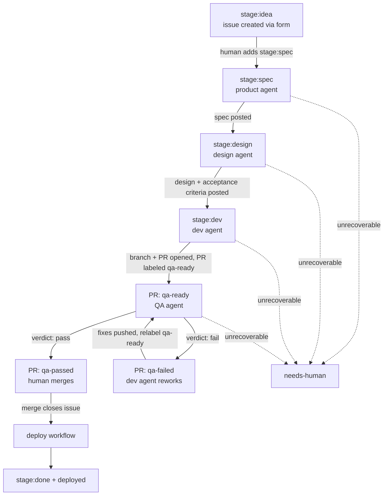

# The Agentic SDLC — State Machine Specification

This document is the contract for the whole pipeline. Every workflow, script, and
agent prompt in this repo implements what is written here. If code and this spec
disagree, the spec wins — fix the code or change the spec in the same PR.

## Principles

1. **Deterministic orchestration, AI-filled content.** GitHub Actions YAML plus
   shell/Python scripts own *when* things happen and *what state changes*. Claude
   owns only the *content* of a phase (a spec, a design, code, a test verdict).
   The model never chooses a state transition.
2. **Structured output or it didn't happen.** Every agent phase must return JSON
   validated against a schema in `ci/claude/schemas/`. Free text is never parsed
   for control flow.
3. **Evidence over assertion.** An agent claim (especially a QA failure) must
   carry reproduction steps and artifact paths. Verdicts without evidence are
   treated as `blocked`, not `fail`.
4. **Humans gate irreversible steps.** Pipeline entry (starting spend) and merge
   (shipping code) are human actions. Everything between is automated.
5. **Transferable.** Nothing here depends on this demo's apps. Swapping the apps,
   the ticket system, or the auth mode is a config change, not a redesign.

## Actors and identities

| Actor | Identity | Used for |
|---|---|---|
| Human | your GitHub account | Files ideas, applies the entry label, merges PRs |
| Pipeline orchestrator | `sdlc-orchestrator` GitHub App (you create it once, see `docs/setup.md`) | **All label transitions and branch pushes that must trigger the next phase.** `GITHUB_TOKEN` events are suppressed by GitHub and never chain. |
| Workflow steps | default `GITHUB_TOKEN` | Everything that must NOT chain: commit statuses, PR comments, artifact uploads |
| Agents | Claude Code headless (`claude -p`), authenticated with `CLAUDE_CODE_OAUTH_TOKEN` | Content generation inside a phase |

Loop safety is our responsibility (GitHub does not suppress App-token recursion):

- Every phase workflow is gated by `if: github.event.label.name == '<its label>'`.
- Every transition removes the inbound label in the same step that adds the
  outbound one. Re-adding a label is the retry mechanism.
- `scripts/loop_guard.sh` counts prior phase-label events on the ticket timeline
  and hard-aborts past `MAX_PHASE_EVENTS` (default 20).
- `scripts/state_lint.py` asserts the label graph below stays acyclic; it runs in CI.

## The state machine

Issue labels carry the pre-code phases. Once code exists, phase labels live on
the **PR** (the `pull_request: labeled` payload carries the head SHA and the run
shows in the PR checks UI); the issue keeps a human-facing mirror label.



### Labels

| Label | On | Meaning | Written by |
|---|---|---|---|
| `stage:idea` | issue | Filed via issue form, not yet approved for the pipeline | issue form |
| `stage:spec` | issue | Product agent is on it | **human** (this is the entry gate) |
| `stage:design` | issue | Design agent is on it | App token |
| `stage:dev` | issue | Dev agent is on it | App token |
| `stage:qa` | issue | Mirror: linked PR is in QA | App token |
| `stage:done` | issue | Merged and deployed | App token |
| `qa-ready` | PR | QA agent should run | App token (dev phase) or human |
| `qa-passed` / `qa-failed` | PR | QA verdict | App token (QA phase) |
| `needs-human` | issue/PR | Pipeline parked; a human must look | App token |
| `deployed` | issue | Deploy workflow finished | App token |

### Phase contracts

Every phase follows the same shape:

```
trigger (labeled event, name-guarded)
  → loop guard
  → deterministic setup (checkout, deps, context files)
  → claude -p invocation (bounded: --max-turns, timeout-minutes, schema-validated output)
  → deterministic post-steps (post comments/statuses with GITHUB_TOKEN)
  → transition (App token: remove inbound label, add outbound label) — in always()
     so the failure path (→ needs-human) also fires
```

| Phase | Workflow | Trigger | Agent skill | Output schema | Success transition |
|---|---|---|---|---|---|
| Product | `phase-product.yml` | issue labeled `stage:spec` | `/product:spec` | `spec-output.json` | → `stage:design`, or → `needs-human` when the spec carries a blocking open question |
| Design | `phase-design.yml` | issue labeled `stage:design` | `/design:design` | `design-output.json` | → `stage:dev` |
| Dev | `phase-dev.yml` | issue labeled `stage:dev` | `/dev:implement` | `dev-report.json` | PR opened with `Fixes #N`, PR labeled `qa-ready`, issue → `stage:qa` |
| Dev rework | `phase-dev.yml` | PR labeled `qa-failed` | `/dev:rework` | `dev-report.json` | push fixes, PR relabeled `qa-ready` |
| QA | `phase-qa.yml` | PR labeled `qa-ready` | `/qa:qa-run` | `qa-verdict.json` | status `qa/agent-verdict` on head SHA; PR → `qa-passed` or `qa-failed` |
| Deploy | `deploy.yml` | push to `main` | none (deterministic) | — | gateway deployed (or simulated), issue → `stage:done` + `deployed` |
| Retro | `phase-retro.yml` | issue labeled `deployed` | `/retro:retro-run` | `retro-output.json` | advisory: retro comment on the ticket + ≤2 `stage:idea` proposal issues, deduped against open ones; no transition |

Phase outputs are durable: the product spec and the design (including numbered
acceptance criteria `AC-1..AC-n`) are posted as issue comments and appended to
the issue body between HTML marker comments, so later phases read them
deterministically with `gh issue view --json body`.

**Blocking open questions.** Each `open_questions` entry from the product phase
carries a `blocking` flag — true only when the answer would change an acceptance
criterion, the scope boundary, or an API/UI contract. With none, the phase
transitions to `stage:design` as before. With one or more, `phase-product.yml`
posts the spec and parks the issue at `needs-human` instead: the design phase
never runs against a spec whose material ambiguities are still open, so a human
answer no longer races the next phase. Answering and re-adding `stage:spec`
re-runs the product agent with the answers in context; that success path also
drops the `needs-human` label.

The dev and rework phases boot `db` + `redis` (`docker compose up -d --wait db
redis`) before the agent runs, with `DATABASE_URL`/`REDIS_URL`/`APP_ENV=test` in
the agent's env, so the dev agent can execute DB-backed tests (`uv run pytest
apps/api`) rather than only pydantic-level smoke checks. This closed a gap found
running ticket #6: DB-touching code could not be self-verified in the dev phase
and leaned entirely on QA. QA remains the authority (it boots the full 8-service
stack); the dev DB is for the agent's own verification loop.

### The QA phase in detail (the centerpiece)

Two tiers, one job (`phase-qa.yml`):

The job checks out the PR's merge ref and first asserts it is fresh: GitHub
computes `refs/pull/N/merge` lazily and a label event does not refresh it, so
after `main` advances a run could test a stale base and re-find bugs `main`
already fixed. If the merge commit's base parent is not the live `main` tip,
the job fails before spending anything — the `always()` transition parks the
PR `needs-human` with a comment telling the human to update the branch and
re-add `qa-ready`.

**Tier 1 — deterministic (the hard gate).**
Before anything boots, a capacity precheck (`scripts/e2e_capacity_check.py`)
counts the collected e2e tests and compares the suite's estimated demand
(1.5 gateway requests per test, anchored on the one measurement we have — 45
tests exhausted a 60 req/10 s budget at the PR #24 breaking point, ~1.33 req per
test) against the job's
`GATEWAY_RATE_LIMIT` (default 600, the single source for both this check and the
`wrangler dev --var RATE_LIMIT:…` boot flag). Headroom under 1.5x warns; under
1.0x — i.e. the budget is below the point where a suite this size actually broke
— the job fails before the stack boots, with no spend, and the PR is parked with
the number to raise. Anything the check cannot measure, including an exception,
is a warning: a safety check must never become the outage. Then boot the stack (`docker compose
up --wait` for api+web, `wrangler dev` for the gateway with the test-profile
request budget, health-gated with curl retries), seed data (`python -m
app.seed`), then:

- API unit + integration tests (`pytest` with httpx `ASGITransport`)
- Contract tests (Schemathesis v4 replaying a committed corpus,
  `qa/tests/contract/corpus.json` — ≤25 cases per operation — against the live
  OpenAPI schema; schema-conformance, documented-status, and no-5xx checks,
  with `positive_data_acceptance`/`negative_data_rejection` excluded by
  design). There is no generation in this path — no PRNG, no import-order
  sensitivity — so the verdict is a pure function of the commit: identical
  requests, run to run. A schema-digest guard (`test_corpus_matches_live_schema`)
  fails the tier loudly, naming the file and `make contract-refresh`, when the
  live API and the committed corpus disagree — corpus drift is always a
  visible, reviewable diff, never a silent change in coverage. Refreshing is a
  human-run step (`make contract-refresh`), not part of the gate; its output is
  Hypothesis-generated and best-effort, reviewed as a diff before it becomes
  the gate's input. Unbounded randomised fuzzing stays non-gating in a
  scheduled workflow. Standing rule: anything a contract run finds once is
  pinned as a deterministic test (precedent: the NUL/surrogate cases in
  `apps/api/tests/test_auth.py` and `test_tasks.py`), not left as a corpus
  entry — a corpus entry can be regenerated away, a pinned test cannot.
- UI E2E (`pytest-playwright` through the gateway, tracing/screenshots retained
  on failure)

Test steps use `continue-on-error` and record outcomes; artifacts (JUnit XML,
traces) always upload.

**Repeat-failure guard (between the tiers).** Before the agent runs,
`scripts/qa_repeat_guard.py` builds a signature of this run — the tested tree
(`git rev-parse HEAD^{tree}`), the per-suite outcomes, and the exact set of
failing tests parsed from the JUnit XML — and compares it with the signature
embedded in the most recent `<!-- sdlc:qa-verdict -->` comment on the PR (only
comments authored by the pipeline are read; PR comments are untrusted input).
When tree, outcomes, and failing set all match and the previous run's
`tier1_triage` classified every one of those failures `infra` or `flake`, tier 2
is skipped and the gate parks the PR at `needs-human`, quoting the signature and
the earlier classification. It is never a pass: a repeat flake earns a red gate
plus a human, not a green one. Keying on the tree rather than the head SHA makes
"nothing that could change the outcome changed" the actual test — it covers a
re-drive on the same SHA and a merge from an unchanged `main`, and an empty
commit cannot unlock it, while any real change (including merging a `main` that
fixed the environment) re-enables the full run. Repo variable
`QA_REPEAT_GUARD=off` disables it; a crash in the guard degrades to a normal paid
run. Evidence: PR #24 paid $3.34 and then $2.36 for two agent passes that reached
the identical conclusion about the identical rate-limit flake.

**Tier 2 — agentic.**
One `claude -p` run (`scripts/run_agent.sh qa`) that receives: the ticket's
acceptance criteria, tier-1 results (as file paths, never piped — 10 MB stdin
cap), and the Playwright MCP server (`--mcp-config`, accessibility-tree driven,
`--isolated --headless`). Its job: verify each `AC-n` end-to-end, run an
exploratory charter (always pull `browser_console_messages` and
`browser_network_requests` — regressions invisible to scripted assertions
surface there), and triage tier-1 failures as bug / infra / flake. It returns a
`qa-verdict.json`-validated object:

```json
{ "verdict": "pass|fail|blocked",
  "acceptance_criteria": [{ "id": "AC-1", "status": "verified|failed|not_testable", "evidence": "...", "covering_test": "tier-1 test id, required when the evidence substitutes a scenario" }],
  "findings": [{ "severity": "critical|high|medium|low", "title": "...",
                 "repro_steps": "...", "artifact_paths": ["..."] }],
  "tier1_triage": [{ "test": "...", "classification": "bug|infra|flake", "reason": "..." }],
  "summary": "..." }
```

Evidence discipline: when the agent verifies an AC with a scenario that is not
the AC's literal one, the evidence must say so and `covering_test` must name the
green tier-1 test asserting the literal case — otherwise the AC is
`not_testable`, not `verified`.

**Gate rule** (deterministic, in YAML): tier-1 all green AND
`structured_output.verdict == "pass"` → commit status `qa/agent-verdict` =
success on the PR head SHA and PR → `qa-passed`. Any tier-1 failure or agent
`fail` → status failure, PR → `qa-failed` with the findings comment. Agent
`blocked`, missing structured output, `is_error`, or error subtypes
(`error_max_turns`, `error_during_execution`) → `needs-human`. A `fail` finding
without `repro_steps` is downgraded to `blocked` by the parsing step. The
repeat-failure guard is evaluated first: `repeat = true` → status failure, PR →
`needs-human`, regardless of what the skipped agent would have said.

Branch protection (ruleset on `main`) requires contexts `ci` and
`qa/agent-verdict`, so the merge button is the human gate over machine-verified
state. A push after QA ran leaves the new head SHA without a status — merge
stays blocked until QA re-runs (fail-safe by construction). The ruleset also
grants repository admins an always-on bypass: the break-glass path for
orchestrator-authored maintenance PRs (pipeline changes, main-branch bugfixes),
which by definition carry no `qa/agent-verdict`. A bypass merge is a deliberate
human governance action outside the machine gate — agents hold no identity that
can use it.

### Agent invocation profile

All phases go through `scripts/run_agent.sh`, the single place where the Claude
invocation is defined:

```
claude -p "<skill invocation + context>" \
  --plugin-dir ci/claude/plugins/<phase> \
  --settings ci/claude/settings/ci-settings.json \
  --permission-mode dontAsk \
  --allowedTools <phase allowlist> \
  --model <phase model> --max-turns <phase cap> --max-budget-usd <phase cap> \
  --mcp-config <phase mcp, if any> --strict-mcp-config \
  --output-format json --json-schema "$(cat ci/claude/schemas/<phase>.json)" \
  --no-session-persistence
```

- Auth: `CLAUDE_CODE_OAUTH_TOKEN` (subscription). We deliberately do **not** use
  `--bare` because bare mode ignores OAuth tokens. The equivalent hardened
  profile for API-key users (`--bare` + `ANTHROPIC_API_KEY`) is documented in
  `docs/setup.md`; the switch is one env var in `run_agent.sh`.
- Skills are packaged as plugins (`ci/claude/plugins/*`) with explicit manifests
  and loaded via `--plugin-dir`, so the same mechanism works in bare and
  non-bare mode. Hooks are NOT used for CI enforcement (they don't run in bare
  mode; enforcement lives in YAML + permission flags).
- Every run's full JSON payload (incl. `total_cost_usd`, `num_turns`,
  `session_id`) is uploaded as an artifact, and every phase surfaces its cost
  line (`Agent phase … N turns, ~$C …`) on the ticket: product/design append
  it to their spec/design comments, dev/rework post it on the issue/PR even
  when the run fails, QA's rides the verdict comment, retro's rides the retro
  comment. `scripts/lab_metrics.py` parses these lines, so full-pipeline
  spend is measurable per ticket (the lab's cost metric).

### Cost and runaway controls

- `--max-turns` per phase (QA 120, dev 120, product/design 30) and
  `--max-budget-usd` (QA 8, dev 12, product/design 3) + job `timeout-minutes` +
  `concurrency: <phase>-<ticket#>` groups. On `error_max_turns`, read
  `permission_denials` first: zero denials with steady progress means the
  phase's scope outgrew the cap (raise it); repeated denials mean a stuck
  agent (fix the sandbox, not the ceiling).
- Loop guard threshold on timeline label events; max 3 QA↔rework cycles before
  `needs-human`.
- Repeat-failure guard: an identical tier-1 failure signature on an identical
  tree, previously triaged `infra`/`flake`, skips tier 2 and escalates to a
  human instead of re-buying the same conclusion.
- Models per phase (aliases, overridable via workflow env): product/design
  `opus`, dev/qa `sonnet`, summaries `haiku`.

### Trust boundaries

- Ticket bodies, PR comments, and pages the QA agent browses are untrusted
  input. Agents never get deploy secrets; the QA job has no Cloudflare token;
  `browser_run_code_unsafe` is disallowed. The dev and QA phases get broad
  `Bash` rather than arg-scoped allowlists: the deny-list, the credential-less
  checkout, and the pre-push privileged-path guard are the enforceable
  boundaries, while an arg-scoped list only auto-denies the compound,
  env-prefixed and piped commands agents naturally write — twice now that has
  burned a phase's whole turn budget fighting the sandbox instead of working
  (PR #10 cycles 2-3 in QA; ticket #36 in dev, 121 turns and $6.25 on 13
  denials). Fix the sandbox, never the ceiling.
- Fork PRs (`isCrossRepository`) are refused: labeled `needs-human`, never run
  with secrets.
- Agents write only to `feature/*` branches; `main` is protected by the ruleset;
  the App has no `workflows: write` (agents cannot edit pipeline definitions —
  workflow file changes are human-only by construction).
- `ci/claude/` (agent charters) and `scripts/` (pipeline glue) are pipeline-
  privileged but have no GitHub-side write gate (`.github/workflows/` does —
  the App lacks `workflows: write`), so layered controls enforce them:
  repo-relative `Edit(...)`/`Write(...)` deny rules in `ci-settings.json`
  steer the agent (a `//`-prefixed pattern bug once left these rules dead, and
  the rework agent edited the QA charter on PR #13), and a deterministic check
  before every dev/rework push fails the job — and parks the ticket
  `needs-human` — if a new agent commit touches those paths (merge-base diff)
  or the working tree under them is dirty (agent child processes can write
  files no commit records, and later steps execute these scripts with the App
  token). Checkouts use `persist-credentials: false`, so the agent step holds
  no token; only the orchestrator's own push steps authenticate. When a design
  mandates a privileged edit (e.g. a QA-charter change), the human
  orchestrator applies it directly; the rework skill tells the agent to route
  such findings through `concerns` instead of fixing them.

### The retro phase (the lab's self-improvement loop)

When a ticket earns `deployed`, `phase-retro.yml` runs a read-only agent over
the ticket's full trajectory (issue + merged-PR comments and label timelines —
these carry every phase's cost, turns, denials, verdicts, and parks). It
returns a schema-validated draft learning-log entry plus at most two improvement
proposals, deduped by the agent against the repo's open `stage:idea` issues
(gathered into its context dir as `open-ideas.json`); a deterministic step posts
the draft as a `<!-- sdlc:retro -->` comment and files the proposals as
`stage:idea` issues. A duplicate is reported in the retro summary as new
evidence for the existing idea rather than filed again.

Governance, by construction rather than convention:

- **Advisory only.** The phase blocks nothing, labels nothing on the source
  ticket, and a failure posts a comment instead of parking — retro can never
  hold a shipped ticket hostage.
- **The loop cannot close itself.** The whole job runs on `GITHUB_TOKEN`
  (whose events never chain), `stage:idea` triggers no phase, and proposals
  enter the pipeline only when a human applies `stage:spec` — the identical
  entry gate features pass through. Landing the drafted learning-log entry on
  `main` is likewise a human/orchestrator act.
- **Bounded.** ≤2 proposals per run, 30-turn/$3 caps, and a loop guard whose
  counted pattern includes `deployed` itself — repeated human re-adds of the
  label cannot re-run retro past the guard's ceiling.

This is the experiment method of `docs/lab-charter.md` folded into the state
machine: every shipped ticket produces its own evidence-backed critique, and
the pipeline improves through the same gated flow as the product it builds.

### Issue → PR resolution

When an issue-triggered phase needs the linked PR: GraphQL
`Issue.closedByPullRequestsReferences`, filtered to `state == OPEN`, asserting
exactly one (`scripts/resolve_pr.sh`). Zero or many → `needs-human`. The dev
agent contract guarantees the invariant: PR body contains `Fixes #N`, PR targets
`main`.
